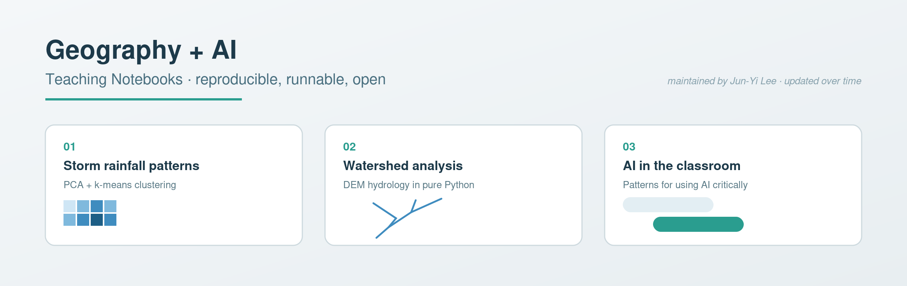
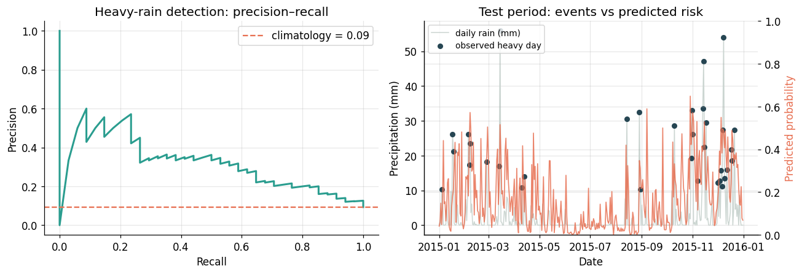

# Geography + AI: Teaching Notebooks

[](https://github.com/junyilee7/geography-ai-teaching/actions/workflows/notebooks.yml)



A growing, open collection of reproducible Jupyter notebooks for **bringing AI and computational methods into geography and hydrology teaching**. Each notebook is a self-contained module: it pairs a clear narrative with runnable code, so that students — and other instructors — can learn by executing every cell.

Maintained by **Jun-Yi Lee (李俊逸), Ph.D.**, a hydrologist and geographer. The collection is updated over time as new datasets, methods, and classroom-tested patterns are added.

## Featured: rainfall prediction with explainable ML

Notebook 1 builds an honest, end-to-end machine-learning workflow on **real daily climate
observations** (NOAA GHCN, 2012–2015), with a temporally honest train/test split and the skill
scores hydrologists actually use. Headline results on the held-out test period:

| Task | Metric | Result | Climatology baseline |
|---|---|---|---|
| Wet-day occurrence | ROC AUC | **0.80** | — |
| Heavy-rain event (>10 mm) detection | PR AUC | **0.33** | 0.09 (**3.5× lift**) |
| Exact daily-total regression | NSE | **0.08** | *(honest counterpoint — see below)* |



The scientific message is the *asymmetry*: rainfall **occurrence and exceedance** carry a learnable
signal from antecedent wetness and seasonality, while the **exact amount** of a given storm is not
skilfully predictable from daily drivers — which is precisely why event-based, threshold-driven
sampling remains indispensable in catchment hydrology. The pipeline is station-agnostic, with a
documented loader stub for swapping in **Taiwan CWB / Water Resources Agency** data.

## Why this repository exists

Geography students increasingly need to read data, write a little code, and use AI tools critically. These notebooks are designed around three principles:

1. **Runnable anywhere, on real data** — notebooks use standard scientific Python (NumPy, pandas, scikit-learn, Matplotlib) and **open, citable datasets** that are downloaded and cached automatically. No licensed software, no API keys.
2. **Narrative first** — the markdown cells explain *why*, not just *how*, so a notebook can be read like a short chapter.
3. **AI as a thinking tool, not an oracle** — where AI is used, students are asked to evaluate and critique its output, never to accept it blindly.

## Notebooks

| # | Notebook | Topic |
|---|---|---|
| 1 | `notebooks/01_rainfall_pattern_ml.ipynb` | Predicting rainfall occurrence & heavy-rain events with explainable ML, on real NOAA observations |
| 2 | `notebooks/02_watershed_gis_python.ipynb` | Watershed analysis from a DEM with pure Python |
| 3 | `notebooks/03_ai_in_geography_teaching.ipynb` | Generative AI as a geography-teaching companion |

Each notebook works on its own; there is no required order.

## Running the notebooks

```bash
git clone https://github.com/junyilee7/geography-ai-teaching.git
cd geography-ai-teaching
python -m venv .venv
source .venv/bin/activate
pip install -r requirements.txt
jupyter lab
```

GitHub also renders `.ipynb` files in the browser, so the notebooks can be read without running anything.

## Topics covered

- Supervised ML on real hydrometeorological time series: feature engineering (seasonality encoding, antecedent precipitation index), temporally honest validation, NSE/KGE skill scores, and explainability (permutation importance, partial dependence)
- Digital elevation model analysis: flow direction, flow accumulation, stream networks, hypsometry, wetness index
- Practical patterns for using large language models and vision models in the classroom
- Critical evaluation of AI output as a learning objective

## Roadmap

This repository is a living resource, updated on a [monthly rhythm](UPDATE_CHECKLIST.md). Planned additions include sequence models (LSTM/Transformer) for streamflow, remote-sensing image classification, and a Taiwan open-data (CWB/WRA) workflow building on the loader stub in notebook 1. Suggestions are welcome via Issues.

## Citation

> Lee, J.-Y. (2026). *Geography + AI: Teaching Notebooks*. GitHub. https://github.com/junyilee7/geography-ai-teaching

## License

Released under the [MIT License](LICENSE). The educational narratives in the markdown cells may be reused in teaching with attribution.
